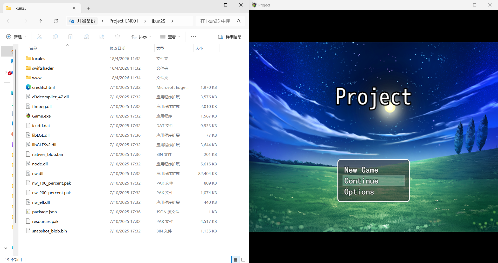

# COMP2116 Software Engineering Final Project
## Project Title: KUNRPG

---

## Graphical Abstract

---

## 1. Purpose of the Software
This software is designed to RPG.

### Software Development Process
We applied the Waterfall development model.

Reason for choosing this model:
- Flexible for requirement adjustment
- Suitable for small team and short development cycle

### Target Market & Usage
- Target users: Players who like to play RPGs
- Main usage scenarios: PC

---

## 2. Software Development Plan
### Development Process
1. Requirement analysis
2. System design
3. Implementation (coding)
4. Testing
5. Demo & deployment

### Members (Roles & Responsibilities)
- Member 1: CHAN CHI PONG – Production of game collection and compilation of general data.
- Member 2: ZHAO FEI – Make video tutorials on game code explanations and analyze code vulnerabilities.
- Member 3: LAM KA WA – Search for materials and analyze code vulnerabilities
- Member 4: LAU KA HEI – Analyze the data and test the code issues

Contribution portion: [28% / 24% / 24% / 24%]

### Schedule
- Week 1–2: Requirement & Design
- Week 3–4: Implementation & Coding
- Week 5: Testing & Debugging
- Week 6: Demo video & Final submission

### Algorithm
Basic logical processing & UI interaction.

### Current Status
The software can run successfully and complete all demo functions.

### Future Plan
- Add more practical features
- Optimize user interface and performance
- Support cross-platform use

---

## 3. Demonstration Video
YouTube URL: [https://youtu.be/kQmR-n2D3uo?si=4BAr-_FhiLRSrrE9]

---

## 4. Development & Runtime Environment
- Programming Language: Python and JavaScript
- Minimum Hardware Requirements: Dual-core CPU, 4GB RAM, Windows/macOS/Linux
- Required Packages / Libraries:
  - [Pixi.js v4.x]
  - [NW.js]
  - [RPG Maker MV CoreScript]

---

## 5. Declaration of Open Sources & Third-Party Resources
We declare that the following third-party libraries/tools are used in this project:
- [NW.js]
- [Pixi.js v4.x]
- [Node.js]
- [Qt]
- [Chromium — NW.js]

All open-source components are used in compliance with their licenses.

---

## GitHub Link
https://github.com/chanchipong1226-dev/GroupProject-KUNRPG.repository